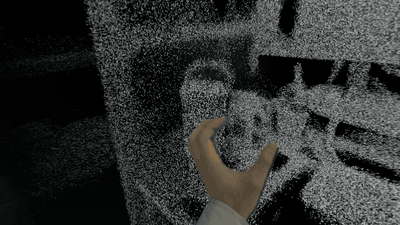
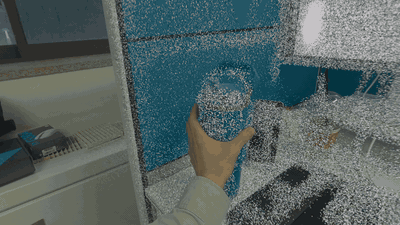

# VGGT 3D Reconstruction + Apple Vision Pro Viewer

Reconstruct 3D point clouds from RGB video using [VGGT (Visual Geometry Grounded Transformer)](https://huggingface.co/facebook/VGGT-1B) and view them in mixed reality on Apple Vision Pro.

<p align="center">
  
  
</p>
<p align="center">
  <em>Left: Point cloud only &nbsp;|&nbsp; Right: Mixed reality (passthrough)</em>
</p>
<p align="center">
  <a href="https://youtu.be/iDad7aC0h2U">Full demo video</a>
</p>

## Overview

This project bridges AI-based 3D reconstruction with spatial computing:

1. **Python pipeline** (`process_video.py`) — Takes video or images, runs VGGT model inference on a GPU server, and exports colored 3D point clouds as GLB/USDZ.
2. **visionOS app** (`VGGTViewer/`) — SwiftUI + RealityKit app for Apple Vision Pro that loads and displays reconstructed 3D scenes in mixed reality with interactive controls.

## Project Structure

```
VGGT/
├── process_video.py          # Video/images → VGGT → GLB pipeline (GPU server)
├── convert_to_bin.py         # GLB/PLY → compact binary format for visionOS
├── render_pointcloud.py      # Render point cloud to PNG (matplotlib)
├── view_3d.py                # Browser-based 3D viewer (Gradio)
├── vggt/                     # VGGT model code (cloned from official repo — see Setup)
│   ├── models/
│   ├── heads/
│   ├── layers/
│   └── utils/
├── visual_util.py            # GLB export utility (from official VGGT repo — see Setup)
└── VGGTViewer/               # visionOS app (Apple Vision Pro)
    └── VGGTViewer/
        ├── VGGTViewerApp.swift      # App entry point, immersive space setup
        ├── AppModel.swift           # Shared state (position, orientation, scale)
        ├── ContentView.swift        # Main window
        ├── TaskView.swift           # File loading + AR controls UI
        ├── ImmersiveView.swift      # RealityKit immersive rendering
        ├── PointCloudLoader.swift   # Binary point cloud → RealityKit mesh
        └── CaptureView.swift        # Capture workflow guide
```

## Setup

### Step 1: Clone This Repository

```bash
git clone https://github.com/Saaan0721/VGGT.git
cd VGGT
```

### Step 2: Set Up VGGT Model Code

`process_video.py` imports from `vggt/` (model architecture) and `visual_util.py` (GLB export). These come from the [official VGGT HuggingFace Space](https://huggingface.co/spaces/facebook/vggt):

```bash
# Clone the official VGGT repo
git clone https://huggingface.co/spaces/facebook/vggt vggt-upstream

# Copy model code and utility into this project
cp -r vggt-upstream/vggt/ ./vggt/
cp vggt-upstream/visual_util.py ./visual_util.py

# Clean up
rm -rf vggt-upstream
```

After this step, verify your directory contains:

- `vggt/models/vggt.py` — VGGT model definition
- `vggt/utils/load_fn.py` — image loading and preprocessing
- `vggt/utils/pose_enc.py` — pose encoding to extrinsic/intrinsic
- `vggt/utils/geometry.py` — depth map unprojection
- `visual_util.py` — `predictions_to_glb()` function

### Step 3: Install Python Dependencies

Requires **Python 3.10+** and a **CUDA-compatible NVIDIA GPU** with **24GB+ VRAM** (tested on RTX A5000).

```bash
pip install torch==2.4.0 torchvision==0.19.0 numpy==1.26.3 \
    opencv-python scipy einops trimesh hydra-core omegaconf
```

> Model weights (~4GB) are automatically downloaded from HuggingFace on the first run and cached at `~/.cache/torch/hub/`.

### Step 4: Verify the Setup

```bash
python -c "from vggt.models.vggt import VGGT; from visual_util import predictions_to_glb; print('Setup OK')"
```

If this prints `Setup OK`, you're ready to go.

## Usage

### Capture Video

Record a video of the target scene or object using any camera (including Vision Pro's built-in camera).

**Tips for best results:**

- Move slowly and steadily
- Capture from multiple angles
- Ensure good lighting
- 10–30 seconds of video is sufficient

### Run 3D Reconstruction

```bash
# From a video file
python process_video.py video.mov -o scene.glb

# From a directory of images
python process_video.py ./images/ -o scene.glb
```

#### Options

| Option             | Default      | Description                                                            |
| ------------------ | ------------ | ---------------------------------------------------------------------- |
| `--output, -o`     | `scene.usdz` | Output file path (.glb or .usdz)                                       |
| `--fps-interval`   | `1.0`        | Frame extraction interval in seconds                                   |
| `--conf-threshold` | `50.0`       | Confidence percentile filter (higher = fewer but more accurate points) |
| `--device`         | `cuda`       | Device (`cuda` or `cpu`)                                               |
| `--brightness`     | `1.0`        | Brightness multiplier                                                  |
| `--saturation`     | `1.0`        | Saturation multiplier                                                  |
| `--mask-black`     | off          | Mask out black background pixels                                       |
| `--export-ply`     | off          | Also export PLY file                                                   |

```bash
# Finer sampling with higher confidence threshold
python process_video.py video.mov -o scene.glb --fps-interval 0.5 --conf-threshold 70

# With color adjustments
python process_video.py video.mov -o scene.glb --brightness 1.3 --saturation 1.5
```

### View Reconstructed Scene

**In browser (Gradio):**

```bash
pip install gradio
python view_3d.py scene.glb
# Opens at http://localhost:7860
```

**Render to PNG:**

```bash
pip install matplotlib
python render_pointcloud.py scene.glb
# Outputs: render_front.png, render_side.png, render_top.png
```

**Convert to binary format (for faster visionOS loading):**

```bash
python convert_to_bin.py scene.glb scene.bin 500000
```

### View on Apple Vision Pro

#### Build the visionOS App

Requires macOS with **Xcode 16+** and **visionOS SDK**.

```bash
open VGGTViewer/VGGTViewer.xcodeproj
```

1. In Xcode, set your development team under **Signing & Capabilities**
2. Select the **Apple Vision Pro** target (device or simulator)
3. Build and run

#### Load and View a 3D Scene

1. Transfer the `.glb` or `.bin` file to Vision Pro (e.g., via AirDrop)
2. In the app, tap **Load 3D File** and select your file
3. Tap **Open AR View** to enter mixed reality

#### AR Controls

| Control                       | Method                                             |
| ----------------------------- | -------------------------------------------------- |
| Position (L/R, Height, Depth) | +/- buttons in UI                                  |
| Rotation                      | Pitch/Roll buttons, or drag gesture on point cloud |
| Scale                         | Scale buttons, or pinch gesture                    |
| Background opacity            | Slider (0% = full passthrough, 100% = black)       |
| Save/Reset                    | Persist or reset view settings                     |

> Enable the **Gesture** toggle to interact with the point cloud directly via drag (rotate) and pinch (scale) gestures.

## Pipeline Architecture

```
Video/Images
    → Extract Frames (OpenCV, configurable FPS interval)
    → VGGT Inference (1B params, bfloat16 AMP)
    → Depth Maps + Confidence + Camera Poses
    → Unproject to World-Space 3D Points
    → Confidence Filtering
    → Export GLB (trimesh)
    → (optional) Convert to .bin
    → Load in Vision Pro → Mixed Reality View
```

## End-to-End Example

```bash
# 1. Reconstruct from video (on GPU server)
python process_video.py my_video.mov -o scene.glb --fps-interval 0.5 --conf-threshold 60

# 2. Preview in browser
pip install gradio
python view_3d.py scene.glb

# 3. Transfer scene.glb to Vision Pro via AirDrop
# 4. Open VGGTViewer app → Load 3D File → Open AR View
```

## Troubleshooting

| Issue                                                  | Solution                                                                                |
| ------------------------------------------------------ | --------------------------------------------------------------------------------------- |
| `ModuleNotFoundError: No module named 'vggt'`          | Run Setup Step 2 — copy `vggt/` from the official repo                                  |
| `ImportError: cannot import name 'predictions_to_glb'` | Run Setup Step 2 — copy `visual_util.py` from the official repo                         |
| CUDA out of memory                                     | Reduce input frames with `--fps-interval 2.0` or higher                                 |
| USDZ conversion fails                                  | Requires macOS `xcrun usdz_converter`; falls back to GLB which also works on Vision Pro |
| Point cloud looks sparse                               | Lower `--conf-threshold` (e.g., 30) to keep more points                                 |
| Colors look dark                                       | Use `--brightness 1.3 --saturation 1.5`                                                 |

## License

This project's own code (`process_video.py`, `VGGTViewer/`, utility scripts) is released under the [MIT License](LICENSE).

**Important:** This project depends on the [VGGT model](https://github.com/facebookresearch/vggt) by Meta AI, which is licensed under [CC-BY-NC-4.0](https://creativecommons.org/licenses/by-nc/4.0/) (non-commercial use only). The VGGT code (`vggt/`, `visual_util.py`) is **not included** in this repository — you must obtain it separately from the official source (see [Setup Step 2](#step-2-set-up-vggt-model-code)). Any use of the VGGT model is subject to Meta's license terms.

## Acknowledgments

Built at [Information Systems Lab (ISL)](https://isl.snu.ac.kr/), Seoul National University.

Contact: [skim@islab.snu.ac.kr](mailto:skim@islab.snu.ac.kr)

- [VGGT](https://github.com/facebookresearch/vggt) by Meta AI — Visual Geometry Grounded Transformer for 3D reconstruction
